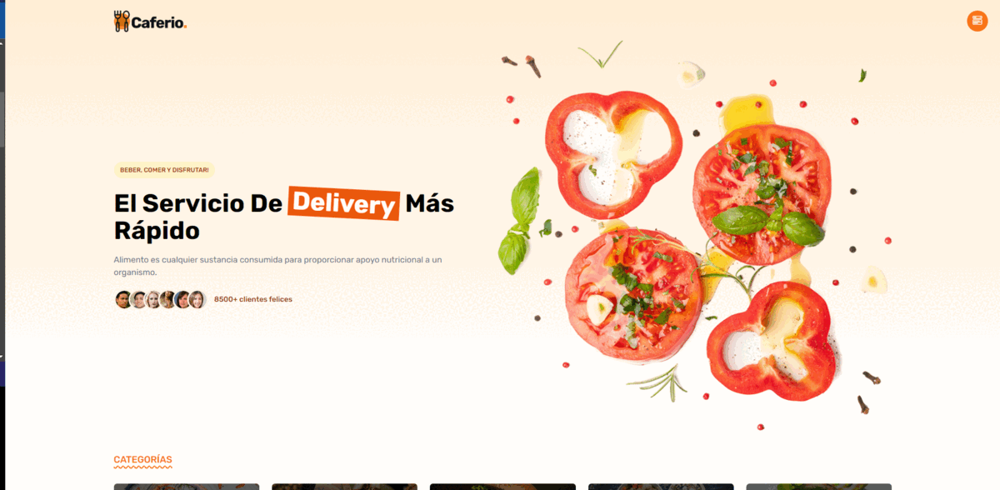

<div align="center">

<h1>LANDING PAGE | TAILWINDCSS VITE </h1>

[]()
[](https://github.com/kylelobo/The-Documentation-Compendium/issues)
[](https://github.com/kylelobo/The-Documentation-Compendium/pulls)
[](/LICENSE)

## 📜 Descripción del proyecto <a name="-descripción-del-proyecto-"></a>

<p>Este es un proyecto de una landing page para una cafetería, diseñada con el framework CSS TailwindCSS y el bundler Vite. La página incluye información sobre la cafetería, sus productos y servicios, horarios de atención, ubicación y formas de contacto.

## 🥇 DEMO 🥇 <a name="-demo--"></a>

</p>
</div>

<div align="center">
<p align="center">
  <a href="" rel="noopener">
 </a>
</p>
</div>

---

<h2> 📝 Tabla de contenido </h2>

- [� Descripción del proyecto ](#-descripción-del-proyecto-)
- [🥇 DEMO 🥇 ](#-demo--)
- [💎 Tecnologías utilizados](#-tecnologías-utilizados)
  - [📖 Requerimientos ](#-requerimientos-)
  - [✒️ Clonar ](#️-clonar-)
  - [⌨️ Uso ](#️-uso-)
  - [⌨️ Estructura del proyecto ](#️-estructura-del-proyecto-)
- [👨‍💻 Desarrollador](#-desarrollador)

## 💎 Tecnologías utilizados<a name="-tecnologías-utilizados"></a>

Este proyecto utiliza las siguientes tecnologías:

- **TailwindCSS** - Framework CSS utilizado para estilizar la página.
- **Vite** - utilizado para compilar y servir la página.
- **Node.js** y npm - Herramientas utilizadas para instalar y manejar dependencias.

### 📖 Requerimientos <a name="-requerimientos-"></a>

Este proyecto incluye las siguientes características:

- Para correr la página localmente, necesitarás tener instalado `Node.js` y `npm` en tu máquina.

### ✒️ Clonar <a name="-clonar-"></a>

Clonar para usarlo en tu servidor local

```
git@github.com:cybertcode/LANDING-PAGE-RESTAUTANTE-CAFETER-A.git
```

ó

```
https://github.com/cybertcode/LANDING-PAGE-RESTAUTANTE-CAFETER-A.git
```

### ⌨️ Uso <a name="-uso-"></a>

Para correr la página localmente, sigue los siguientes pasos:

- Clona este repositorio en tu máquina.
- Abre una terminal y navega hasta el directorio del proyecto.
- Ejecuta el comando npm install para instalar las dependencias del proyecto.
- Ejecuta el comando npm run dev para iniciar un servidor local en el puerto 3000.
- Abre un navegador web y navega a `http://127.0.0.1:5173/` para ver la página.

### ⌨️ Estructura del proyecto <a name="-estructura-del-proyecto-"></a>

El proyecto está organizado de la siguiente manera:

- `index.html`: El archivo HTML principal que define la estructura de la página.
- `src/`: El directorio donde se encuentran los archivos CSS y JS.
- `src/styles.css`: El archivo CSS principal donde se define el estilo de la página con TailwindCSS.
- `src/main.js`: El archivo JS principal que inicializa la página con Vite y define la funcionalidad de la página.

## 👨‍💻 Desarrollador<a name="desarrollador"></a>

<div  align="center">

[](https://github.com/cybertcode)

[](https://github.com/cybertcode)

<p align="center">
   Mis redes sociales :<br/><br/>
    <a href="https://www.linkedin.com/in/marvyn-kevyn-huanca-hilario-a12699b7/"></a>
    <a href="https://www.facebook.com/profile.php?id=100047330599374"></a>
    <a href="https://gitlab.com/cybert22"></a>
    <a href="https://www.instagram.com/mkevynhh"></a>
    <a href="https://www.twitch.tv/cybert22"></a>
    <a href="https://twitter.com/Kevyn94"></a>
</p>

</div>

---

</br>
<div align="center">
<p align="center"> © 2023 Cybertcode, todos los derechos Reservados. Hecho con mucho ❤️ . </p>
<p align="center">
https://www.cybertcode.com
</p>
</div>
